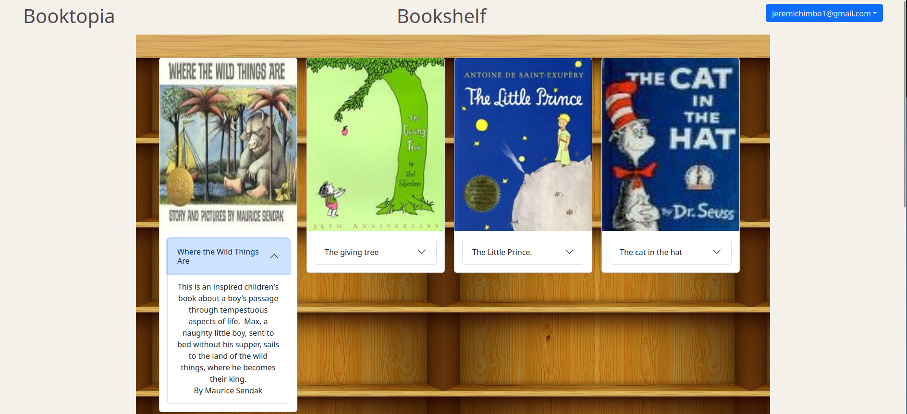

# Booktopia

A fullstack website for storing a booklist and searching for books using Springboot, Google Oauth, and the Open Book Api. I first started devloping this application as way to keep track of books I was interested in, without the hassle of writing down title names or screenshoting covers and having them being lost in my phone storage. This app would serve as a dedicated bookshelf for the books that I'd be interested in picking up at a later date. I plan to implement a recommendation system using book genres and rating score. I also plan to move from API calls to OpenLibrary to using a copy of their Database so that I get faster load times as well as do more data manipulation for the recommendation system.

## Getting Started
After cloning and going through the requirments simply run <code>mvn install</code> to run with test or <code>  mvn install -DskipTests</code> to run without 
test. The app should start on port 8080. If you have not setup a domain it should be localhost:8080.

## Requirements

### MySQL
Please use this guide to setup [MYSQL](https://www.digitalocean.com/community/tutorials/how-to-install-mysql-on-ubuntu-22-04).

#### Manual Database Setup
This project requires a MySQL database to be up and running the database's
information has to be customized in the application properties file located in /src/main/java/resources.
This is where you will replace the following lines with the information between the `<customizedArea>`. 

Lines to be altered:
<ol>
  <li>spring.datasource.url=jdbc:mysql://localhost:3306/databaseName</li>
  <li>spring.datasource.username=username</li>
  <li>spring.datasource.password=password</li>
  <li>book.url.customProperty=http://domain/book/</li>
</ol>

Create default database:

<code>CREATE DATABASE '`<databaseName>`';</code>

Create default user:

<code>CREATE USER '`<username>`'@'`<domain>`' IDENTIFIED BY '`<password>`';</code>

Grant Permissions on tomcat database:

<code> GRANT CREATE, ALTER, DROP, INSERT, UPDATE, DELETE, SELECT, REFERENCES, RELOAD ON `<database>`.* TO `<username>`'@'`<domain>`'</code>

To create it login to mysql using the user information made above: <code>sudo mysql -u `<username>` -p  </code>

The database is structured so that there are two required tables users, and book_list. 

The users table is made up of two columns
user_name and user_email, where the primary key is user_name. 

To create this table: <code> CREATE TABLE users(user_name varchar(255) NOT NULL, user_email varchar(255) NOT NULL, PRIMARY KEY (user_email));</code>

The book_list table is made up of two columns, user_email and book_ibsn, where the primary key is a composition of both columns.

To create this table: <code> CREATE TABLE book_list(user_email varchar(255) NOT NULL, book_isbn varchar(255) NOT NULL,PRIMARY KEY (user_email,book_isbn));</code>

### GOOGLE OAUTH
Please follow these steps to get a client_id, client_secret, and a token_uri, [GOOGLE OAUTH](https://developers.google.com/identity/protocols/oauth2).

### GOOGLE BOOKS API
You will also need a google api key to access the google book api. This is to serve as the api that will handle request from the frontend of the application.
Click on credentials link to get an API KEY from the [GOOGLE BOOKS API](https://developers.google.com/books/docs/v1/using#APIKey).
